  

<h3 align="center">Independent builder focused on AI, automation, and thoughtful web experiences.</h3>

  <a href="https://github.com/hosseintavakoli-dev?tab=repositories">Explore my work</a>
  &nbsp;·&nbsp;
  <a href="https://github.com/hosseintavakoli-dev">GitHub profile</a>

---

### Current focus

- Building **KELYROX** — a motion-first digital studio.
- Learning and applying **AI engineering, agents, APIs, and automation**.
- Creating practical, polished web experiences.

### Working with

  
  
  

---

Building with curiosity, craft, and a bias for useful things.

